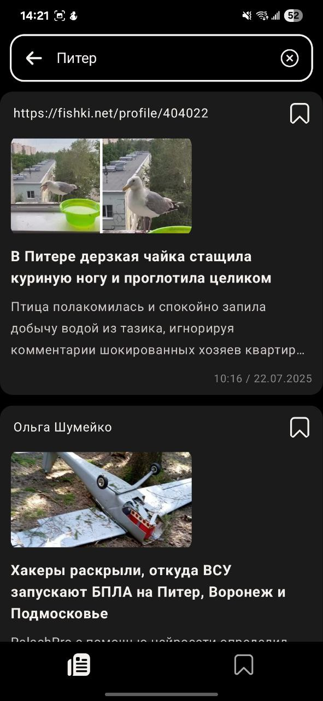
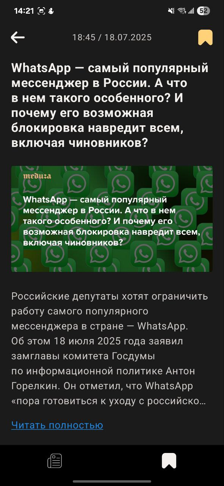

# ChapkirNews 📰

**ChapkirNews** — это Android-приложение для чтения новостей, разработанное на **Kotlin** с использованием современных подходов и технологий Android. Проект создан как демонстрация продвинутых навыков мобильной разработки, включая **Jetpack Compose**, **XML UI**, **Clean Architecture**, **Paging 3**, **Room** и **Hilt**.

---

## 🚀 Основные возможности

* 📑 Лента новостей с поддержкой пагинации (**Paging 3**)
* ⭐ Добавление новостей в избранное (офлайн-доступ через **Room**)
* 🔍 Поиск по ключевым словам и автоматическое обновление ленты
* 🔄 Swipe to refresh в ленте новостей
* 🎨 Наличие двух независимых отдельных UI-модулей: **Jetpack Compose** и **XML**
* 🛠️ Навигация через **Compose Navigation** и **Navigation Component** (XML)
* 🤖 Архитектура **Clean Architecture + MVVM**
* 👾 Кэширование изображений через **Coil**
* 📱 Поддержка светлой и темной темы

---

## 💡 Особенности проекта

* Две реализации интерфейса (Compose и XML) в отдельных модулях
* Строгий подход к разделению слоёв (**data/domain/presentation**)
* Использование **ViewModel + StateFlow (в app_compose) + LiveData (в app_xml)** для управления состоянием
* Реактивная загрузка данных и интеграция с **Flow**
* Поддержка офлайн-режима с кэшированием избранных новостей

---

## 📊 Стек технологий

* **Kotlin**
* **Jetpack Compose** + **Material 3**
* **XML UI**
* **Navigation Component / Compose Navigation**
* **Hilt (DI)**
* **Retrofit + Gson + OkHttp** (сеть)
* **Room (локальное хранилище)**
* **Coil (кэш изображений)**
* **Coroutines + Flow** (асинхронность)
* **Paging 3** (пагинация)

---

## 🛠️ Установка и запуск

1. Клонируйте репозиторий:

   ```text
   git clone https://github.com/chapkir/ChapkirNews.git
   ```


2. Получите API-ключ на [newsapi.org](https://newsapi.org).

3. Добавьте ключ в `local.properties`:

   ```text
   NEWS_API_KEY=your_api_key_here
   ```


4. Откройте проект в Android Studio (Hedgehog или новее) и запустите один из UI модулей.

---

## 📺 Структура проекта

```text
ChapkirNews/
├─ app_compose/      # UI модуль на Jetpack Compose + StateFlow
├─ app_xml/          # UI модуль на XML + LiveData
├─ data/             # Сетевые источники, репозитории
├─ domain/           # Use Cases и бизнес-логика
└─ di/               # Управление зависимостями
```

---

## 🖼️ Скриншоты






---

## 📝 Лицензия

```text
Copyright 2025 Kirill Chapkin  
  
Licensed under the Apache License, Version 2.0 (the "License");  
you may not use this file except in compliance with the License.  
You may obtain a copy of the License at  
  
       http://www.apache.org/licenses/LICENSE-2.0  
              
Unless required by applicable law or agreed to in writing, software  
distributed under the License is distributed on an "AS IS" BASIS,  
WITHOUT WARRANTIES OR CONDITIONS OF ANY KIND, either express or implied.  
See the License for the specific language governing permissions and  
limitations under the License. 
```
